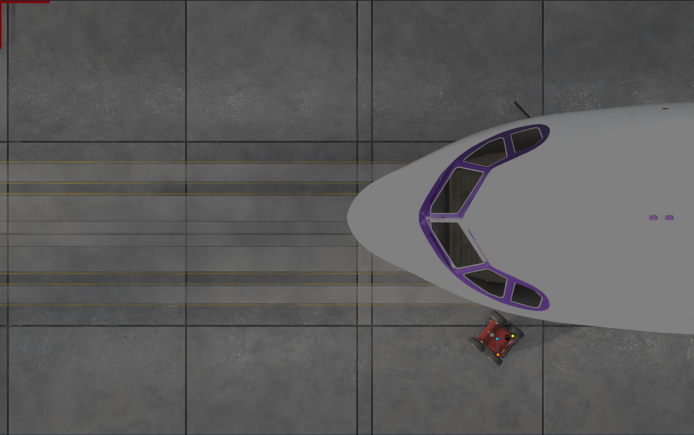

# Panther robot - Keypoints pose detection

## Overview
This repository contains Python scripts and datasets for analyzing and training pose estimation models. The project is structured to facilitate training, testing, and evaluating pose estimation models using various datasets and metrics.



## Repository Structure
```
pose_metrics_analysis.py          # Analyze pose metrics
training.py                       # Train pose estimation models
testing_evaluation.py             # Evaluate testing results
test_orientation.py               # Test orientation-related metrics
test_orientation_plots.py         # Generate plots for orientation tests
dataset/                          # Contains datasets for training, validation, and testing
  version-X/                      # Dataset version X
    data.yaml                     # Dataset configuration file
    train/                        # Training data
    valid/                        # Validation data
    test/                         # Testing data
heading_plots/                    # Contains heading-related plots
runs/                             # Stores training and evaluation runs
tests/                            # Contains test cases
```

## Example Usage

### 1. Training a Model
To train a pose estimation model, use the `training.py` script:
```bash
python training.py
```

### 2. Evaluating Test Results
To evaluate the results of testing, use the `testing_evaluation.py` script:
```bash
python .\testing_evaluation.py --model .\runs\train\yolo11n-panther_v4-obb-v1\weights\best.pt --data dataset/version-4/data.yaml --name yolo11n-panther_v4-obb-v1 --center-metric
```

### 3. Analyzing Pose Metrics
To analyze pose metrics, use the `pose_metrics_analysis.py` script:
```bash
python pose_metrics_analysis.py
```

### 4. Testing Orientation
To test orientation-related metrics, use the `test_orientation.py` script (e.g. for example in the first 40 images in the test split):
```bash
python test_orientation.py --count 40
```

### 5. Generating Orientation Plots
To generate plots for orientation tests, use the `test_orientation_plots.py` script:
```bash
python test_orientation_plots.py
```

## Dataset
The dataset is located online in the roboflow web-site. The most recent versions:
- [Version 1](https://app.roboflow.com/robotics-playground/panther-pose/1)

## Results
Results from training and evaluation are stored in the `runs/` directory. This includes metrics, plots, and model weights.
